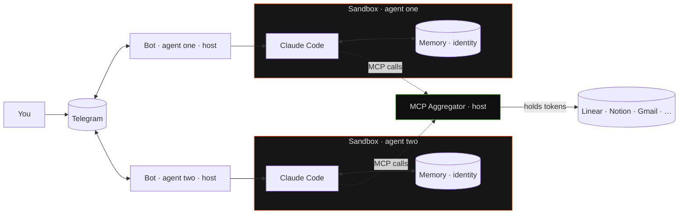
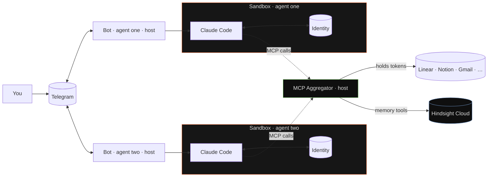

# README memory diagram + memory copy fix — Implementation Plan

> **For agentic workers:** REQUIRED SUB-SKILL: Use superpowers:subagent-driven-development (recommended) or superpowers:executing-plans to implement this plan task-by-task. Steps use checkbox (`- [ ]`) syntax for tracking.

**Goal:** Fix the README architecture diagram and reframe Hindsight as primary memory backend / `MEMORY.md` as fallback in both `README.md` and `ARCHITECTURE.md`.

**Architecture:** Documentation-only change. Four edits across two files. No code, no tests. Verification is `Read` + visual inspection of file content. Two commits — one per file.

**Tech Stack:** Markdown + Mermaid (rendered by GitHub). No build step.

**Spec:** `docs/superpowers/specs/2026-04-28-readme-memory-diagram-design.md`

---

## File Structure

Two files, no new files, no deletions:

- **`README.md`** — three contiguous-but-separate edits: line 61 intro sentence, lines 86-92 "Memory" section, lines 108-136 Mermaid diagram.
- **`ARCHITECTURE.md`** — one edit: lines 352-382 "Memory" subsection (swap mode order, relabel, move legacy-tools paragraph to end).

Editing top-to-bottom (line 61 → 86 → 108) so a reviewer reading the diff in order sees the narrative arc match the document arc.

---

## Task 1: Fix README.md — intro line, Memory section, Mermaid diagram

**Files:**
- Modify: `README.md`

- [ ] **Step 1: Update the "Memory and evolving identity" intro at line 61**

Use Edit on `README.md`:

`old_string`:
```
Managed with Hindsight Cloud for semantic recall (append-only), or as a plain `MEMORY.md` file the agent curates itself. Either way, memory survives restarts and compounds over time. Each agent also writes its own identity and personality on first launch. Details below.
```

`new_string`:
```
Hindsight Cloud is the primary backend — semantic recall, append-only, per-chat scoped. A local `MEMORY.md` fallback is available for users who do not want a cloud dependency. Either way, memory survives restarts and compounds over time. Each agent also writes its own identity and personality on first launch. Details below.
```

- [ ] **Step 2: Replace the "Memory" section (lines 86-92)**

Use Edit on `README.md`:

`old_string`:
```
### Memory

Two modes, one switch in `agent.yaml`.

- **Hindsight** — managed semantic memory cloud. Append-only: every turn auto-retains a delta, next turn auto-recalls what matters. Per-chat tagging, prefetch cache. The agent remembers who it is talking to, what it was working on yesterday, and which stack the user runs — without replaying the whole transcript.
- **`MEMORY.md`** — local file, curated by the agent itself via Claude Code's Edit/Write tools. For anyone who does not want a cloud dependency.

Either way, memory survives restarts. Nothing resets when you `right up` again.
```

`new_string`:
```
### Memory

The primary path is **Hindsight Cloud** — a managed semantic memory service. Append-only: every turn auto-retains a delta, next turn auto-recalls what matters. Per-chat tagging, prefetch cache. The agent remembers who it is talking to, what it was working on yesterday, and which stack the user runs — without replaying the whole transcript.

A fallback is available — **`MEMORY.md`** — a local file the agent curates itself via Claude Code's Edit/Write tools. No semantic recall, no per-chat tagging; just a markdown file the agent maintains. For anyone who does not want a cloud dependency.

Either way, memory survives restarts. Nothing resets when you `right up` again.
```

- [ ] **Step 3: Replace the Mermaid diagram block (lines 108-136)**

Use Edit on `README.md`:

`old_string`:
````

````

`new_string`:
````

````

- [ ] **Step 4: Verify all three edits landed**

Run:
```bash
rg -n 'I1\[\(Identity\)\]|HS\[\(Hindsight Cloud\)\]|primary path is \*\*Hindsight Cloud\*\*|primary backend — semantic recall' /Users/molt/dev/rightclaw/README.md
```

Expected: 4 matches — `I1[(Identity)]` in the diagram, `HS[(Hindsight Cloud)]` in the diagram, `primary path is **Hindsight Cloud**` in the Memory section, `primary backend — semantic recall` on the intro line.

Also run:
```bash
rg -n 'M1\[\(Memory · identity\)\]|M2\[\(Memory · identity\)\]|Two modes, one switch' /Users/molt/dev/rightclaw/README.md
```

Expected: 0 matches — old strings should be gone.

- [ ] **Step 5: Commit README changes**

```bash
git add README.md
git commit -m "$(cat <<'EOF'
docs(readme): hindsight as primary memory; identity-only in sandbox

Mermaid diagram drew memory inside the sandbox; reality is host-side
(Hindsight via aggregator, or MEMORY.md fallback on host). Split
identity (per-sandbox) from memory (Hindsight Cloud, separate node).
Reframe Memory section to lead with Hindsight, position MEMORY.md as
fallback.
EOF
)"
```

---

## Task 2: Reframe ARCHITECTURE.md "Memory" subsection

**Files:**
- Modify: `ARCHITECTURE.md`

- [ ] **Step 1: Replace the "Memory" subsection (lines 352-382)**

Use Edit on `ARCHITECTURE.md`:

`old_string`:
```
### Memory

Two modes, configured per-agent via `memory.provider` in agent.yaml:

**File mode (default):** Agent manages `MEMORY.md` via CC Edit/Write.
Bot injects file contents into system prompt (truncated to 200 lines).
No MCP memory tools.

**Hindsight mode (optional):** Hindsight Cloud API (`api.hindsight.vectorize.io`),
one bank per agent. Three MCP tools exposed via aggregator:
`memory_retain`, `memory_recall`, `memory_reflect`. Prefetch cache is in-memory
(lost on restart → blocking recall on first interaction).

Auto-retain after each turn: content formatted as JSON role/content/timestamp
array, `document_id` = CC session UUID (same as `--resume`), `update_mode:
"append"` so only new content triggers LLM extraction (O(n) vs O(n²) for
full-session replace). Tags: `["chat:<chat_id>"]` for per-chat scoping.

Auto-recall before each `claude -p`: query truncated to 800 chars, tags
`["chat:<chat_id>"]` with `tags_match: "any"` (returns per-chat + global untagged
memories). Prefetch uses same parameters.

**Cron jobs skip memory:** Cron and delivery sessions perform no auto-recall
or auto-retain. Cron prompts are static instructions — recall results would be
irrelevant and corrupt user memory representations (same approach as hermes-agent
`skip_memory=True`). Crons can call `memory_recall` and `memory_retain` MCP tools
explicitly when needed.

The legacy `store_record` / `query_records` / `search_records` / `delete_record`
tools are removed from the surface; their backing tables (`memories`,
`memories_fts`, `memory_events`) are retained for migration compat.
```

`new_string`:
```
### Memory

Two modes, configured per-agent via `memory.provider` in agent.yaml:

**Hindsight mode (primary):** Hindsight Cloud API (`api.hindsight.vectorize.io`),
one bank per agent. Three MCP tools exposed via aggregator:
`memory_retain`, `memory_recall`, `memory_reflect`. Prefetch cache is in-memory
(lost on restart → blocking recall on first interaction).

Auto-retain after each turn: content formatted as JSON role/content/timestamp
array, `document_id` = CC session UUID (same as `--resume`), `update_mode:
"append"` so only new content triggers LLM extraction (O(n) vs O(n²) for
full-session replace). Tags: `["chat:<chat_id>"]` for per-chat scoping.

Auto-recall before each `claude -p`: query truncated to 800 chars, tags
`["chat:<chat_id>"]` with `tags_match: "any"` (returns per-chat + global untagged
memories). Prefetch uses same parameters.

**Cron jobs skip memory:** Cron and delivery sessions perform no auto-recall
or auto-retain. Cron prompts are static instructions — recall results would be
irrelevant and corrupt user memory representations (same approach as hermes-agent
`skip_memory=True`). Crons can call `memory_recall` and `memory_retain` MCP tools
explicitly when needed.

**File mode (fallback):** Agent manages `MEMORY.md` via CC Edit/Write.
Bot injects file contents into system prompt (truncated to 200 lines).
No MCP memory tools.

The legacy `store_record` / `query_records` / `search_records` / `delete_record`
tools are removed from the surface; their backing tables (`memories`,
`memories_fts`, `memory_events`) are retained for migration compat.
```

Notes on this rewrite:

- Hindsight block moves to the front and gets the `(primary)` label.
- The auto-retain / auto-recall / cron-skip paragraphs follow Hindsight (they describe Hindsight-specific behavior — File mode has none of these).
- File mode block follows, with `(fallback)` label. Per the spec, no clarification of the code-level default — readers of the architecture doc can read the code if they care about deserialization defaults.
- Legacy-tools paragraph remains at the end as a section closer.

- [ ] **Step 2: Verify the edit landed**

Run:
```bash
rg -n 'Hindsight mode \(primary\)|File mode \(fallback\)|File mode \(default\)|Hindsight mode \(optional\)' /Users/molt/dev/rightclaw/ARCHITECTURE.md
```

Expected: exactly two matches — `Hindsight mode (primary)` and `File mode (fallback)`. The two `(default)` / `(optional)` strings should be gone.

Also run:
```bash
rg -n -A 1 '^### Memory$' /Users/molt/dev/rightclaw/ARCHITECTURE.md
```

Expected: shows the heading followed by the "Two modes, configured per-agent…" line — confirms section structure is intact.

- [ ] **Step 3: Commit ARCHITECTURE.md change**

```bash
git add ARCHITECTURE.md
git commit -m "$(cat <<'EOF'
docs(architecture): reframe memory modes — hindsight primary, file fallback

Drop (default)/(optional) labels in favor of (primary)/(fallback) to
match the README pitch. Code default in
crates/right-agent/src/agent/types.rs is unchanged.
EOF
)"
```

---

## Self-Review

**Spec coverage check** — every spec section maps to a task:

| Spec section | Implemented in |
|---|---|
| Diagram replacement (lines 108-136) | Task 1, Step 3 |
| README "Memory" section (lines 86-92) | Task 1, Step 2 |
| README intro line 61 | Task 1, Step 1 |
| `ARCHITECTURE.md` "Memory" subsection | Task 2, Step 1 |
| Out-of-scope: code default unchanged | Honored — no code edits in plan |
| Out-of-scope: types.rs:129 doc comment | Honored — not in plan |

**Placeholder scan** — no TBDs, no "implement later", no "similar to Task N", no `add appropriate handling`. All `old_string` / `new_string` blocks are complete.

**Type / name consistency** — `I1` / `I2` (identity nodes), `HS` (Hindsight node), `AGG`, `EXT` — all match between the diagram block and the verification grep in Task 1, Step 4.

**Line-number drift** — Task 1 edits use Edit's old/new string matching, not line numbers, so the order (line 61 → 86 → 108) within Task 1 does not produce drift bugs. Task 2 edits a separate file. No drift risk.
