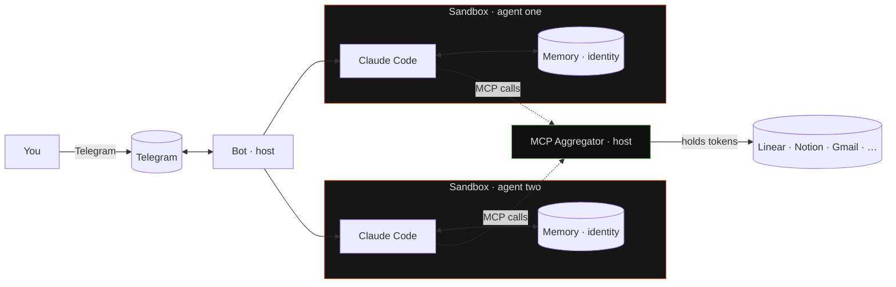

# README Relaunch Design Spec

Date: 2026-04-19
Status: approved
Supersedes: `docs/superpowers/specs/2026-04-08-readme-design.md` (for README only; INSTALL.md and SECURITY.md live documents are not replaced).

## Goal

Rewrite `README.md` as the primary artefact of a public open-source relaunch. Target virality via Show HN + Twitter/X simultaneously. End-users of Claude subscriptions, not Rust developers, are the audience.

## Scope

**In scope:**
- Full rewrite of `README.md` at repo root.
- Production of one embedded architecture diagram (mermaid, inline in README).
- One demo GIF referenced from README, produced as a separate asset (path: `docs/assets/demo.gif`). Asset production is out of scope for this spec — the README treats the file as an input.

**Out of scope:**
- Landing page, Show HN post copy, Twitter thread, Reddit posts.
- `docs/INSTALL.md`, `docs/SECURITY.md`, `ARCHITECTURE.md`, `PROMPT_SYSTEM.md` rewrites.
- Demo GIF recording, editing, compression.
- Brand-asset SVGs (wordmark). Assumed to already exist under `docs/assets/`.

## Positioning

- **Hero frame (H2):** "run a fleet of Claude Code agents on your $20 subscription" — economic angle, indie-dev friendly.
- **Technical frame (H3):** "sandboxed multi-agent runtime" — for the security-aware reader.
- **Decoration (H1):** "the proper claude code runtime" — opposition tagline, used in hero line and closing paragraph.
- **Decoration (H4):** "give your Claude Code agents a phone number" — not used literally; served via the demo GIF.

## Voice and tone

Follow `docs/brand-guidelines.html` §06 strictly:
- precise, lowercase-first, serious-friendly, opinionated, terse
- no marketing-speak (`revolutionize`, `empower`, `seamlessly`, `effortlessly`, rocket emoji, any emoji)
- no Title Case headings, no exclamation marks
- use brand level-glyphs (`✓ ! ✗ …`) only in terminal snippets, not in prose
- wordmark spelling: `RightClaw` in prose (Title Case — this is a mention, not the wordmark); `rightclaw` in the CLI block and lockups

Comparison mode: T2 (soft) — no competitor names in the comparison table. Two paragraphs inside the document (§3.3 and §5 closing) use unnamed phrasing ("in most agent setups", "without OpenShell") that is pointedly critical but legally and factually safe. These two are deliberate, not accidents of tone.

## Structural approach: Hybrid C

Short opener → install early → four feature groups → narrative middle → architecture → comparison → roadmap → footer. HN readers see `install` within the first scroll; Twitter clickers see the GIF and the tagline; philosophy readers get Apple-analogy and self-evolving narrative in §4.

## Top-level section map

```
1. HERO                — wordmark, badges, tagline, one-liner, demo GIF
2. QUICK START         — 3 prerequisite bullets + install code block
3. WHAT YOU GET        — four grouped blocks
4. SELF-EVOLVING       — four sub-blocks (identity / memory / opinionation / honesty)
5. ARCHITECTURE        — NVIDIA OpenShell intro + mermaid + four benefit blocks + closing
6. HOW IT COMPARES     — soft table + two-line footer
7. ROADMAP             — shipped + next
8. DOCS · LICENSE      — short links + credits
```

## Section-by-section design

### §1. Hero

Centred block:

```html
<p align="center">
  
</p>

<p align="center">
  <b>the proper claude code runtime</b><br/>
  a fleet of claude code agents, one telegram thread each,
  sandboxed, remembers everything.<br/>
  runs on your $20 claude subscription.
</p>

<p align="center">
  <a href="https://crates.io/crates/rightclaw-cli"></a>
  <a href="LICENSE"></a>
  <a href="https://github.com/onsails/rightclaw/actions"></a>
  <a href="TELEGRAM_CHAT_URL_PLACEHOLDER">Telegram</a>
</p>

<p align="center">
  
</p>
```

**Open input:** the Telegram chat URL. User will create the chat; implementation must prompt for it and substitute. If the chat URL is not ready at implementation time, the Telegram badge line MUST be removed (not left as a placeholder).

**Open input:** the demo GIF. If `docs/assets/demo.gif` does not exist at commit time, the `` line MUST be removed (do not ship a README with a broken image). A follow-up task will produce the asset.

### §2. Quick Start

Prerequisites collapsed to three bullets — names only, no install steps. Full install in `docs/INSTALL.md`:

```markdown
## Quick Start

Prerequisites:
- [Claude Code CLI](https://docs.anthropic.com/en/docs/claude-code)
- Telegram bot token from [@BotFather](https://t.me/BotFather)
- [cloudflared](https://developers.cloudflare.com/cloudflare-one/connections/connect-networks/) with a named tunnel (for Telegram webhook ingress)

```sh
curl -LsSf https://raw.githubusercontent.com/onsails/rightclaw/master/install.sh | sh
rightclaw init --telegram-token <YOUR_BOT_TOKEN>
rightclaw up
```

Full install guide: [docs/INSTALL.md](docs/INSTALL.md).
```

### §3. What you get out of the box

Four H3 blocks. Each block is 2–6 sentences, no bullet spam except where a list aids scannability (§3.3).

**§3.1 A fleet of Claude Code agents**

> Each agent is a separate Claude Code session inside its own sandbox. Separate identity, separate memory, separate Telegram thread. All of them run on your Claude subscription — no API keys, no per-agent billing.

**§3.2 Memory and evolving identity**

> Managed with Hindsight Cloud for semantic recall, or as a plain `MEMORY.md` file the agent edits itself. Either way, memory is append-only — it grows, it does not get rewritten. Each agent also writes its own identity and personality on first launch. Details in §4.

**§3.3 MCP without the breach**

```
Every MCP server is a credential. Your Linear token. Your Notion
OAuth. Your Gmail. Your production Sentry.

In most agent setups, those secrets are directly reachable to the
agent — on disk, in environment variables, in its config files.
No sandbox, no credential provider. One prompt injection — one
compromised webpage the agent reads, one malicious memory, one
leaky skill — and the attacker walks away with your workspace,
your mailbox, your customer data. Possibly worse.

RightClaw runs a single MCP aggregator on the host, outside every
sandbox. Your secrets live there. Agents talk to the aggregator,
the aggregator talks to the MCP server. The agent never sees the
token.

  · OAuth, bearer, custom header, query-string — all four auth
    patterns, auto-detected
  · Tokens refresh automatically, silently
  · Install a server once — every agent you own gets it
  · Compromised agent? Worst case it misuses the MCP. It can
    never exfiltrate the key.

This is what `right by default` means.
```

Rendering: prose paragraphs as Markdown paragraphs; bullets as Markdown list. No ASCII frames in the final README (the frames in this spec exist only for readability of the spec).

**§3.4 Everything in Telegram**

> Claude login, MCP OAuth, file attachments in both directions, cron notifications, `/doctor`, `/reset` — one thread. The terminal is needed exactly once: to run `rightclaw up`.

### §4. Self-evolving by design

Four H3 blocks inside this H2.

**§4.1 Identity that writes itself**

> The first session with a fresh agent is not a chat — it's a bootstrap. The agent answers questions about who it wants to be: name, tone, boundaries, relationship with the user. It writes `IDENTITY.md`, `SOUL.md`, `USER.md` — in its own hand. From then on those files ship in every system prompt. Restarting the bot doesn't lose them. Swapping the model doesn't lose them.

(Optional screenshot of a real agent's `IDENTITY.md` excerpt goes here. If not available at commit time, omit.)

**§4.2 Memory**

> Two modes, one switch in `agent.yaml`.
>
> - **Hindsight** — managed semantic memory cloud. Auto-retain after every turn, auto-recall before the next. Per-chat tagging, prefetch cache. The agent remembers who it is talking to, what it was working on yesterday, and which stack the user runs — without replaying the whole transcript.
> - **`MEMORY.md`** — local file, edited by the agent itself via Claude Code's Edit/Write tools. For anyone who does not want a cloud dependency.
>
> Both modes are append-only: memory grows, never gets overwritten. Restarting the bot breaks nothing.

**§4.3 One channel, one memory, one identity**

> Most agent runtimes give you fifty knobs and call configuration a feature. RightClaw gives you one well-worn path — Telegram chat, append-only memory, evolving identity — and polishes it end-to-end.
>
> No pluggable memory engines. No matrix of chat backends. No twelve ways to configure a personality. No opt-in sandbox (it's on by default).
>
> This is a position, not a limitation.

**§4.4 What is not here yet**

> Auto-skills — where an agent writes its own skills from repeated tasks — is not shipped. Skills today are hand-written or installed from third-party sources. The skill format is compatible with [skills.sh](https://skills.sh).

### §5. Architecture

Subheading (immediately under `## Architecture`):

> The sandbox layer is [**NVIDIA OpenShell**](https://github.com/NVIDIA/OpenShell) — purpose-built for AI agents, not a container runtime stretched to fit.

**Mermaid diagram** (inline, GitHub-rendered):



Colour palette matches `docs/brand-guidelines.html`: panel `#161616`, orange `#E8632A` (sandbox borders), ok-green `#6bbf59` (aggregator border).

**Four benefit blocks follow. Each block is a H3.**

**§5.1 Blast radius, contained**

> The agent reads a poisoned webpage. A skill turns out to be hostile. An MCP returns a prompt injection. These things happen.
>
> In RightClaw, those scenarios break one sandbox — not your machine, not your files, not another agent. The agent can read only the paths you allowed. It can write only to those same paths. There is no way out of the sandbox for it.

**§5.2 You see what leaves — and you decide**

> Every outbound request passes through OpenShell's policy engine, which terminates TLS and filters at HTTP-method-plus-path level. Not "allow the domain" — "allow POST to this endpoint, nothing else."
>
> Permissive by default with full logging. One line in `agent.yaml` flips to restrictive: the agent can reach `anthropic.com` and nothing else.

**§5.3 Your secrets stay yours**

> Claude auth, MCP tokens, OAuth refresh tokens — on the host. In the sandbox only proxy endpoints. The MCP aggregator makes sure no external-service credential ever reaches any agent.
>
> OpenShell goes further: a credential provider puts not the token but an opaque placeholder into the sandbox's environment. The real secret is substituted by the proxy layer at the moment of the outbound request — in headers, Basic auth, query, path. If the placeholder cannot be resolved, the request fails closed. Built-in provider types cover GitHub, GitLab, Claude, OpenAI, NVIDIA, plus `generic` for anything else.
>
> What that will mean for agents that use `gh`, `gcloud`, `aws`, `kubectl` inside a sandbox: `gh pr create` works, `echo $GITHUB_TOKEN` returns a placeholder, copying it into memory or an MCP call leaks nothing — because the token is nowhere to copy. Wiring this into RightClaw is on the roadmap below; the infrastructure it rides on is already in OpenShell.

**§5.4 One control plane**

> After `rightclaw up`, the terminal is done. Claude login, MCP authorisation, file exchange, cron notifications — one Telegram thread.

**Closing paragraph:**

> Sandboxing for appearance's sake is a dead formality. A sandbox in which an agent actually lives — for months, across restarts, upgrading, talking to the outside world through a policy engine — is infrastructure work. NVIDIA did that work in OpenShell. We use it.
>
> Without it, an agent lives in a plain container with no rules on it. For a demo, that is enough. To leave agents running while you sleep — it is not.

### §6. How it compares

Table (no competitor names, eight rows, chosen to each be backed by a section above):

```markdown
| | Typical multi-agent runtime | RightClaw |
|---|---|---|
| **Sandbox** | plain container, no built-in rules | OpenShell: policy, TLS inspection, credential provider |
| **Credential exposure** | tokens live inside agent env and files | placeholders only; real creds on host |
| **MCP secrets** | copied into every agent | single aggregator; agents never see them |
| **Memory** | replay full history each turn | append-only; Hindsight or local file |
| **Identity** | system prompt in a config file | agent writes its own IDENTITY.md / SOUL.md |
| **Control surface** | CLI + config files + dashboards | one Telegram thread |
| **Claude billing** | requires API key per agent | one Claude subscription, any number of agents |
| **Scope** | configurable everything | one opinionated path, polished end-to-end |
```

Footer (two lines):

> Other runtimes optimise for flexibility and breadth — you can wire anything to anything. RightClaw optimises for a single well-worn path: Telegram in, sandboxed Claude Code out, with memory and identity that outlive restarts.

### §7. Roadmap

```markdown
## Roadmap

**Shipped**
- [x] Multi-agent orchestration, sandboxed by default
- [x] MCP aggregator — OAuth, bearer, header, query-string
- [x] Evolving identity: agent writes its own IDENTITY.md / SOUL.md / USER.md
- [x] Append-only memory: Hindsight Cloud or local MEMORY.md
- [x] Telegram as single control plane: login, MCP auth, files, cron
- [x] Telegram group chats and thread routing
- [x] Media groups (albums, mixed attachments) in both directions
- [x] Declarative cron with Telegram notifications
- [x] Agent backup & restore (`rightclaw agent backup` / `--from-backup`)
- [x] `rightclaw doctor` end-to-end diagnostics

**Next**
- [ ] OpenShell credential providers for `gh`, `gcloud`, `aws`, `kubectl` — zero-token CLIs inside sandboxes
- [ ] Agent templates — shareable configs with MCPs, skills, identity presets
- [ ] Auto-skills — agent writes its own skills from repeated tasks
- [ ] Per-turn budget caps for chat messages (currently cron-only)
- [ ] Agent-to-agent communication

Full project tracker on [GitHub Issues](https://github.com/onsails/rightclaw/issues).
```

### §8. Docs · License · Credits

```markdown
## Docs

- [Installation](docs/INSTALL.md) — full prerequisites
- [Security model](docs/SECURITY.md) — policies, credential isolation, threat model
- [Architecture](ARCHITECTURE.md) — internal topology, SQLite schema, invocation contract
- [Prompting system](PROMPT_SYSTEM.md) — how agent system prompts are assembled

## License

Apache-2.0. Use it, fork it, ship it.

## Credits

Built on [Claude Code](https://docs.anthropic.com/en/docs/claude-code),
[NVIDIA OpenShell](https://github.com/NVIDIA/OpenShell),
and [process-compose](https://github.com/F1bonacc1/process-compose).
```

## Explicit omissions

The following sections from the current README are deliberately dropped:

- **Security** as a top-level block — merged into §5 (Architecture) and `docs/SECURITY.md`.
- **Compliance** as a standalone block — the "runs on your Claude subscription" claim lives in the hero one-liner.
- **Features** as a long flat list — restructured into §3 (four blocks) and §5 (benefit blocks).
- **Prerequisites** as an H2 — collapsed to three bullets inside Quick Start.

The following items do **not** appear anywhere in the new README:

- Chrome integration, Karpathy LLM Wiki, Homebrew/nix distribution, binary releases as roadmap bullets.
- Rust as a positioning attribute. The project is implemented in Rust; this is a footnote, not an identity. Visible only via the crates.io badge.
- `process-compose`, `gRPC`, `SQLite`, `cloudflared`, `mTLS` as user-facing terms. These are in `ARCHITECTURE.md`.

## Asset requirements

| Asset | Path | Source | Status |
|---|---|---|---|
| Wordmark | `docs/assets/rightclaw-wordmark.svg` | brand guide | assumed to exist |
| Demo GIF | `docs/assets/demo.gif` | to be produced separately | missing → line omitted |
| Identity screenshot | inline in §4.1 | optional | omit if not available |
| Telegram chat URL | hero badge | user to provide | substitute or remove line |

If the wordmark SVG does not exist at implementation time, fall back to a plain H1 `# RightClaw` heading instead of the ``.

## Acceptance criteria

1. README renders correctly on GitHub (mermaid diagram visible; no broken image tags; no dangling placeholders).
2. No competitor names appear anywhere in the document.
3. No marketing-speak (see voice list above). A search for `revolutionize|empower|seamless|effortless|🚀|🎉` returns zero hits.
4. All eight sections present in the specified order.
5. Every row in §6 is backed by a claim substantiated earlier in the document.
6. `Shipped` and `Next` in §7 match the current state of the repository at the implementation date. If features ship between spec-write and implementation, the lists are updated accordingly.
7. File length is between 250 and 450 lines (rough guidance, not a hard limit).

## Open items (carry into implementation plan)

1. Telegram chat URL — user to provide before README ships. If not ready, remove the Telegram badge line entirely.
2. Demo GIF production — tracked separately. If not ready at commit time, remove the `` line.
3. Optional `IDENTITY.md` screenshot for §4.1 — include if a shareable example is available.
4. Wordmark SVG — verify presence at `docs/assets/rightclaw-wordmark.svg`; add if missing before ship.
5. **Factual boundary in §5.3.** As of 2026-04-19, RightClaw does not yet generate OpenShell credential-provider config in `policy.yaml`. §5.3 deliberately separates "what RightClaw does today" (MCP aggregator + Claude auth on host) from "what OpenShell supports" (placeholder-mode credential providers for CLIs). The provider-wiring work is a "Next" roadmap item; do not strengthen §5.3 to claim provider-backed token isolation until that wiring lands.
